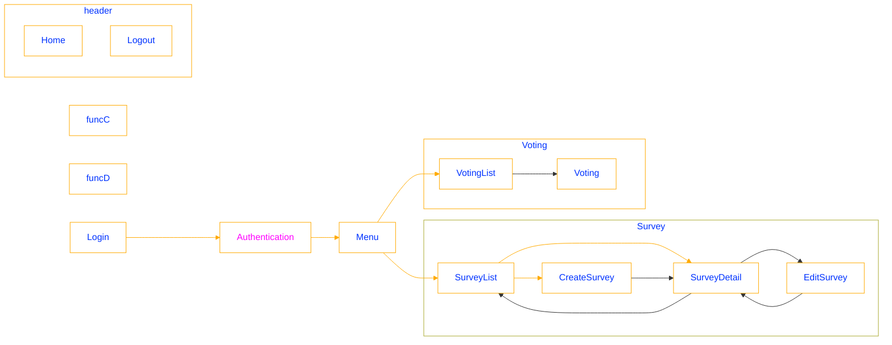

# Voting-Survey-apps
Voting and Survey application

## General
- This application is the simple web service. User create the vote contents and others response the vote and this application view the voting result in real time.

- Use Angular in this application

## Application detail
### Authentication
- Register the user information function
- Login and Logout function
- Management the authentication state

### Create voting and Management function
- Create voting view and function
  - Login users can create the new vote in below contents.
    - Title
    - Question
    - Choices (Minimum: 2 - Maximum: 5)
    - Arrow Multiple selection or not

- Voting list view and function
  - View the created vote list and user edit or delete the each created vote

- Edit and delete function
  - Users can the edit and delete the created vote contents

- Deta management
  - All data is managed in the PostgreSQL database.

- Voting page
  - Users access the public voting and vote the public voting

- The result in real time
  - Update the result in real time completed vote

- UI/UX
  - Use angular framework
    - Chart.js or D3.js etc...

## Screen transition diagram

    

